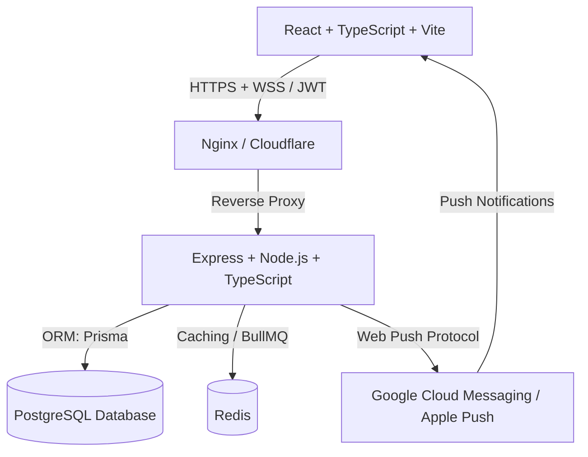
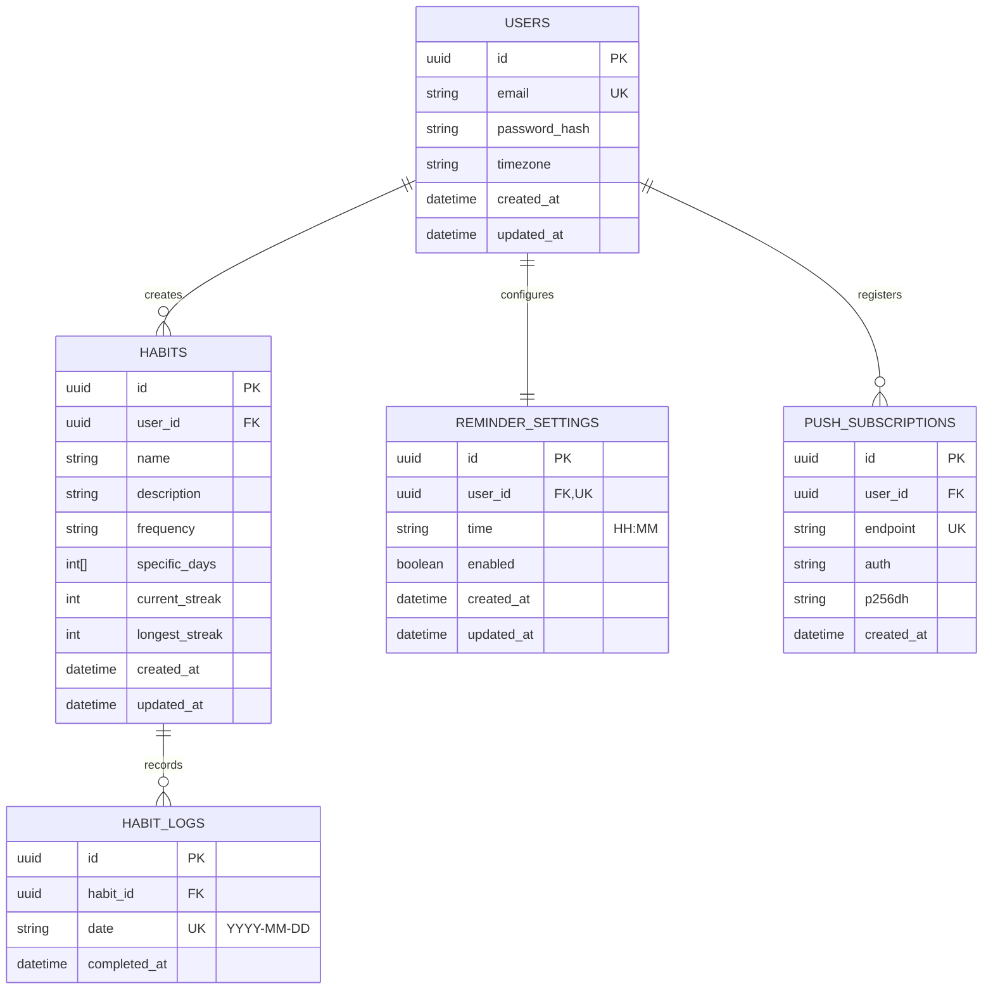
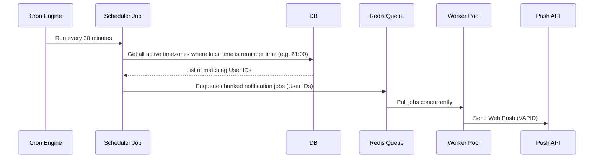
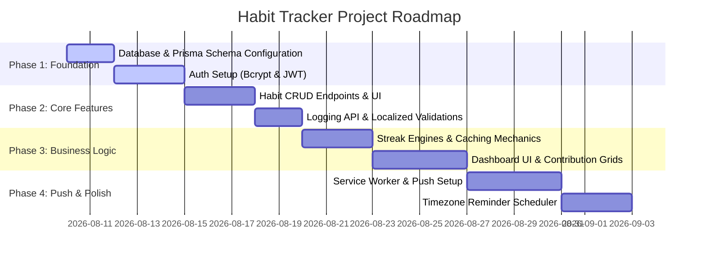

# Habit Tracker: System Architecture & Technical Design

This document details the production-ready architecture, database schema, API design, authentication mechanism, and scalability plan for the habit-tracking web application.

---

## 1. Technical Stack & Rationale



| Component | Technology | Rationale |
| :--- | :--- | :--- |
| **Frontend Core** | **React (v18+) & TypeScript** | Component-driven architecture, robust type safety across APIs, and a large ecosystem for charts and dates. |
| **Frontend Build** | **Vite** | Extremely fast hot module replacement (HMR) and optimized rollup-based production builds compared to traditional Webpack. |
| **Styling** | **Vanilla CSS Modules** | Ensures scoped styling, zero run-time CSS-in-JS overhead, maximum control over premium transitions/animations, and complies with clean visual standards. |
| **State & Fetching** | **TanStack Query (React Query)** | Out-of-the-box support for caching, auto-refetching, optimistic updates (critical for fast habit toggling), and server-state sync. |
| **Backend Core** | **Node.js, Express, & TypeScript** | Unified language stack (TypeScript front-to-back), lightweight routing, and high asynchronous I/O performance. |
| **Database** | **PostgreSQL** | Relational integrity for user-habit mappings, rich support for dates/timezones, and index performance for time-series logging. |
| **ORM** | **Prisma** | Auto-generated type-safe database client, declarative schema migrations, and clean relationship mapping. |
| **Authentication** | **JWT & Bcrypt** | Stateless session verification using JWTs, with password security managed via high-work-factor bcrypt hashing. |
| **Asynchronous Tasks** | **Redis & BullMQ** | Handles deferred task queues (e.g., sending daily reminder push notifications, processing streak updates asynchronously). |

---

## 2. Directory Layouts

### 2.1. Client Directory Layout (React + Vite)

```
client/
├── public/
│   ├── favicon.ico
│   └── sw.js                     # Service Worker for handling Push Notifications
├── src/
│   ├── assets/                   # Global fonts, branding assets, custom animations
│   ├── components/               # Scoped, reusable UI components
│   │   ├── dashboard/            # Progress grids, streak stats, charts
│   │   ├── habits/               # Habit cards, creation modals, logging buttons
│   │   └── ui/                   # Pure UI controls (Button, Input, Dropdown, Modal)
│   ├── context/                  # Context providers (AuthContext, ThemeContext)
│   ├── hooks/                    # Custom hooks (useAuth, useHabits, usePush)
│   ├── layouts/                  # Layout shells (DashboardLayout, AuthLayout)
│   ├── pages/                    # Routed view pages (Login, Dashboard, Analytics, Settings)
│   ├── services/                 # Axios clients and React Query hooks
│   ├── types/                    # TypeScript interfaces for API contracts
│   ├── utils/                    # Timezone conversions, date mathematics helpers
│   ├── App.tsx                   # Main router and provider configuration
│   ├── index.css                 # CSS variables, utility tokens, global animations
│   └── main.tsx                  # Client entrypoint
├── package.json
├── tsconfig.json
└── vite.config.ts
```

### 2.2. Server Directory Layout (Express + TS)

```
server/
├── prisma/
│   ├── migrations/               # Database migration history
│   ├── schema.prisma             # Declarative database model
│   └── seed.ts                   # Initial data populator
├── src/
│   ├── config/                   # DB clients, environment variables, web-push keys
│   ├── controllers/              # Request controllers (auth, habits, logs, settings)
│   ├── middleware/               # Auth guards, request validation, error handlers
│   ├── routes/                   # Route grouping definition files
│   ├── services/                 # Heavy lift business logic (streaks, notification scheduler)
│   ├── types/                    # Extended Express typing (e.g., custom Request user properties)
│   ├── utils/                    # Token management, date helpers
│   └── app.ts                    # Express app initialization
├── tests/                        # Unit and integration test suites
├── docker-compose.yml            # Local PostgreSQL and Redis orchestration
├── package.json
└── tsconfig.json
```

---

## 3. Database Schema

The database schema is designed with an explicit separation between the **actual UTC execution timestamp** (`completedAt`) and the **local target calendar date** (`date` represented as `YYYY-MM-DD`). This prevents timezone offsets from shifting historical logs.



### Prisma Schema (`schema.prisma`)

```prisma
datasource db {
  provider = "postgresql"
  url      = env("DATABASE_URL")
}

generator client {
  provider = "prisma-client-js"
}

model User {
  id               String             @id @default(uuid())
  email            String             @unique
  passwordHash     String             @map("password_hash")
  timezone         String             @default("UTC") // E.g., "America/New_York", "Asia/Kolkata"
  createdAt        DateTime           @default(now()) @map("created_at")
  updatedAt        DateTime           @updatedAt @map("updated_at")
  
  habits           Habit[]
  reminderSettings ReminderSetting?
  pushSubscriptions PushSubscription[]

  @@map("users")
}

model Habit {
  id            String     @id @default(uuid())
  userId        String     @map("user_id")
  user          User       @relation(fields: [userId], references: [id], onDelete: Cascade)
  name          String
  description   String?
  frequency     String     @default("DAILY") // Options: DAILY, WEEKLY, CUSTOM
  specificDays  Int[]      @map("specific_days") // 0 (Sunday) to 6 (Saturday) for CUSTOM frequency
  currentStreak Int        @default(0) @map("current_streak")
  longestStreak Int        @default(0) @map("longest_streak")
  createdAt     DateTime   @default(now()) @map("created_at")
  updatedAt     DateTime   @updatedAt @map("updated_at")
  
  logs          HabitLog[]

  @@map("habits")
}

model HabitLog {
  id          String   @id @default(uuid())
  habitId     String   @map("habit_id")
  habit       Habit    @relation(fields: [habitId], references: [id], onDelete: Cascade)
  date        String   @map("date") // Format: "YYYY-MM-DD" in user's timezone
  completedAt DateTime @default(now()) @map("completed_at") // Actual UTC timestamp of completion

  @@unique([habitId, date]) // A habit can only be logged once per local calendar date
  @@map("habit_logs")
}

model ReminderSetting {
  id        String   @id @default(uuid())
  userId    String   @unique @map("user_id")
  user      User     @relation(fields: [userId], references: [id], onDelete: Cascade)
  time      String   // E.g., "20:00" representing local execution time
  enabled   Boolean  @default(true)
  createdAt DateTime @default(now()) @map("created_at")
  updatedAt DateTime @updatedAt @map("updated_at")

  @@map("reminder_settings")
}

model PushSubscription {
  id        String   @id @default(uuid())
  userId    String   @map("user_id")
  user      User     @relation(fields: [userId], references: [id], onDelete: Cascade)
  endpoint  String   @unique
  auth      String
  p256dh    String
  createdAt DateTime @default(now()) @map("created_at")

  @@map("push_subscriptions")
}
```

> [!IMPORTANT]
> **Timezone Boundary Design Decision**
> Storing the local date as a pre-computed string `YYYY-MM-DD` solves the critical timezone boundary problem. For example, if a user in Tokyo (`UTC+9`) completes a habit at `01:30 AM` on August 10th, the UTC time is `August 9th, 04:30 PM`. Storing just the UTC timestamp would attribute this log to August 9th in raw queries, breaking the user's perception of their streak. By checking the user's current timezone on the client or server, we generate the string `"2026-08-10"` and save it directly.

---

## 4. REST API Design

### 4.1. Authentication Router (`/api/auth`)

* **`POST /register`**: Registers a new user.
  * **Payload:** `{ "email": "user@example.com", "password": "securepassword", "timezone": "America/New_York" }`
  * **Response:** `201 Created` with secure HTTPOnly token cookie + JSON payload containing user info.
* **`POST /login`**: Logs in an existing user.
  * **Payload:** `{ "email": "user@example.com", "password": "securepassword" }`
  * **Response:** `200 OK` with cookie + user metadata.
* **`POST /logout`**: Clears authorization state.
  * **Response:** `200 OK` (clears cookie).
* **`GET /me`**: Retrieves current authenticated profile.
  * **Response:** `200 OK` `{ "id": "uuid", "email": "user@example.com", "timezone": "America/New_York" }`

### 4.2. Habit Management Router (`/api/habits`)

* **`GET /`**: Fetches all active habits for the user, including cached streak metrics.
  * **Response:** `200 OK` `[{ "id": "uuid", "name": "Drink Water", "currentStreak": 5, "longestStreak": 12, "frequency": "DAILY" }]`
* **`POST /`**: Creates a new habit.
  * **Payload:** `{ "name": "Read", "description": "15 mins of a book", "frequency": "CUSTOM", "specificDays": [1, 3, 5] }`
* **`GET /:id`**: Fetches details for a single habit, including visual log histories.
* **`PUT /:id`**: Updates parameters of a habit.
* **`DELETE /:id`**: Archives/Deletes a habit.

### 4.3. Habit Logging & Streaks Router (`/api/habits/:id/logs`)

* **`POST /`**: Marks a habit complete for a specific day.
  * **Payload:** `{ "date": "2026-08-09" }` (validated to ensure it matches the user's local timezone window).
  * **Response:** `200 OK` `{ "log": { "id": "uuid", "date": "2026-08-09" }, "currentStreak": 6 }` (returns updated streak).
* **`DELETE /:date`**: Un-marks (toggles off) a completed habit for a specific day.
  * **Response:** `200 OK` `{ "success": true, "currentStreak": 5 }`
* **`GET /streak`**: On-demand deep-recalculation of current and longest streaks.
  * **Response:** `200 OK` `{ "currentStreak": 5, "longestStreak": 12, "calculationTimestamp": "UTC..." }`

### 4.4. Reminder Management Router (`/api/reminders`)

* **`GET /settings`**: Retrieves user's default notification profile.
* **`PUT /settings`**: Modifies target time and enable/disable states.
  * **Payload:** `{ "time": "21:30", "enabled": true }`
* **`POST /subscribe`**: Registers a Web Push Notification subscription object payload.
  * **Payload:** `{ "endpoint": "...", "keys": { "p256dh": "...", "auth": "..." } }`

---

## 5. Auth Architecture & Session Management

To ensure standard security and defend against both **Cross-Site Scripting (XSS)** and **Cross-Site Request Forgery (CSRF)**, a hybrid JWT strategy is employed.

```mermaid
sequenceDiagram
    autonumber
    actor Client as Client App (React)
    participant Server as App Server (Express)
    database DB as Postgres

    Client->>Server: POST /api/auth/login (credentials)
    Server->>DB: Fetch user & verify password hash
    DB-->>Server: User record
    Note over Server: Generate Access Token (JWT - 15m)<br/>Generate Refresh Token (Secure UUID/JWT - 7d)
    Server->>DB: Store active refresh token session
    Server-->>Client: Set HTTPOnly Cookie (Refresh Token)<br/>Return Payload (Access Token + Expiry)
    Note over Client: Keep Access Token in application memory
    
    Client->>Server: GET /api/habits (Authorization: Bearer <Access Token>)
    Server-->>Client: 200 OK (Habit List)

    Note over Client: Access Token Expired
    Client->>Server: POST /api/auth/refresh (Include HTTPOnly Cookie)
    Server->>DB: Verify active refresh token state
    Server-->>Client: Return new short-lived Access Token
```

### Key Configurations

1. **Access Token**: Short-lived (15 minutes). Carries user payload (`id`, `email`, `timezone`). Transmitted in the `Authorization: Bearer <token>` header. Stored solely in memory on the client.
2. **Refresh Token**: Long-lived (7 days). Stored in a database-backed table (or Redis) to allow revocation. Handled via an **`httpOnly`**, **`secure`**, **`sameSite: 'strict'`** cookie.
3. **Password Security**: Hashed on creation using `bcryptjs` with a work factor (salt rounds) of `12`.
4. **CSRF Mitigation**: Mitigated naturally since the short-lived access token is not automatically sent by the browser during cross-site requests. The cookie containing the refresh token is restricted using `sameSite: 'strict'`, protecting the token refresh path.

---

## 6. Timezone Handling & Streak Logic

### 6.1. How Timezone Boundaries are Enforced

When a log request is received on the server, the server validates the incoming `date` payload (e.g., `"2026-08-09"`) against the user's localized real time to prevent spoofing:

```typescript
import { DateTime } from 'luxon';

export function validateLogDate(clientDateStr: string, userTimezone: string): boolean {
  // Get today's and yesterday's date string in user's timezone
  const userNow = DateTime.now().setZone(userTimezone);
  const todayStr = userNow.toFormat('yyyy-MM-dd');
  const yesterdayStr = userNow.minus({ days: 1 }).toFormat('yyyy-MM-dd');

  // Permit completion logging only for today or yesterday (grace period)
  return clientDateStr === todayStr || clientDateStr === yesterdayStr;
}
```

### 6.2. Streak Calculation Algorithm

This helper algorithm computes both the current active streak and longest historical streak for a list of calendar dates, handling custom weekly schedules and simple daily tracking:

```typescript
import { DateTime } from 'luxon';

/**
 * Calculates current and longest streaks based on calendar logs.
 * Supports: DAILY habits (must complete every calendar day)
 * 
 * @param logDates Array of logged date strings (Format: YYYY-MM-DD), unique and sorted descending
 * @param timezone The user's timezone
 */
export function calculateDailyStreak(logDates: string[], timezone: string): { currentStreak: number; longestStreak: number } {
  if (logDates.length === 0) {
    return { currentStreak: 0, longestStreak: 0 };
  }

  const userNow = DateTime.now().setZone(timezone);
  const todayStr = userNow.toFormat('yyyy-MM-dd');
  const yesterdayStr = userNow.minus({ days: 1 }).toFormat('yyyy-MM-dd');

  // 1. Check if the latest log is recent enough to maintain a streak
  const latestLogStr = logDates[0];
  if (latestLogStr !== todayStr && latestLogStr !== yesterdayStr) {
    // Streak is broken because they did not log today or yesterday
    // However, they could still have a historical longest streak
    return {
      currentStreak: 0,
      longestStreak: calculateLongestHistoricalStreak(logDates)
    };
  }

  // 2. Count backwards from the latest log
  let currentStreak = 1;
  let cursor = DateTime.fromISO(latestLogStr, { zone: timezone });

  for (let i = 1; i < logDates.length; i++) {
    const expectedPrevDayStr = cursor.minus({ days: 1 }).toFormat('yyyy-MM-dd');
    if (logDates[i] === expectedPrevDayStr) {
      currentStreak++;
      cursor = cursor.minus({ days: 1 });
    } else {
      break; // Gap detected: streak calculation stops here
    }
  }

  const longestStreak = Math.max(currentStreak, calculateLongestHistoricalStreak(logDates));

  return { currentStreak, longestStreak };
}

function calculateLongestHistoricalStreak(logDates: string[]): number {
  if (logDates.length === 0) return 0;
  
  let longest = 1;
  let tempStreak = 1;
  
  for (let i = 0; i < logDates.length - 1; i++) {
    const current = DateTime.fromISO(logDates[i]);
    const next = DateTime.fromISO(logDates[i + 1]);
    
    // Check if the next record is exactly one calendar day prior
    if (current.minus({ days: 1 }).toISODate() === next.toISODate()) {
      tempStreak++;
    } else {
      longest = Math.max(longest, tempStreak);
      tempStreak = 1;
    }
  }
  
  return Math.max(longest, tempStreak);
}
```

---

## 7. Scalability & Optimization Notes

### 7.1. Database Optimization for Log Queries

As user histories grow, the `habit_logs` table accumulates data quickly.

1. **Indexes**: A composite unique index on `(habit_id, date DESC)` ensures queries to get sorted dates (for calculations) are extremely fast index-only scans.
2. **Denormalization / Caching**: Dynamic calculation of streaks on every dashboard view is expensive. The current and longest streaks are cached on the `Habit` record.
   * **Reads (`GET /habits`)**: `O(N)` where N is number of active habits (instant lookup of pre-calculated values).
   * **Writes (`POST /logs`)**: Trigger streak recalculation on that specific habit only. This writes the update back to the `Habit` table, localizing the computation burden to the write phase.

### 7.2. Push Notifications & Reminder Engine Scalability

A naive scheduler querying reminders minute-by-minute performs poorly under load. Instead, use a **Timezone-Bucketed Worker Pattern** powered by **Redis & BullMQ**:



1. **Query Strategy**: We bucket users by their local timezone. The scheduler runs every 30 minutes. It calculates the offset that matches the current time slot. E.g., if it's `14:30 UTC`, the target local reminder time is `20:00` for `UTC+5:30` (Asia/Kolkata).
2. **Database Query**:

   ```sql
   SELECT u.id, p.endpoint, p.auth, p.p256dh
   FROM users u
   JOIN push_subscriptions p ON p.user_id = u.id
   JOIN reminder_settings r ON r.user_id = u.id
   WHERE r.enabled = true
     AND r.time = '20:00'
     AND u.timezone = 'Asia/Kolkata';
   ```

   *By indexing `timezone` and `time`, this query avoids raw date calculations inside Postgres and executes instantly.*
3. **Queueing**: Instead of sending Web Push requests inline (which might time out or block connection pools), the scheduler pushes payloads into a worker queue (e.g. BullMQ). Distributed workers process these asynchronously and respect external Web Push API rate limits.

---

## 8. Development Roadmap



### Dependency Chain

1. **Auth & Setup**: Establish database, user models, register/login handlers, and client security store.
2. **Habit CRUD**: Build basic tables, forms, list views, and delete pipelines.
3. **Log & Streaks**: Implement toggle functionality, unique day constraints, and streak count updates.
4. **Dashboard**: Construct interactive grids (similar to GitHub contributions), progress charts, and performance summaries.
5. **Reminders**: Implement Web Push subscriptions, the service worker handler, and the backend cron scheduler.
